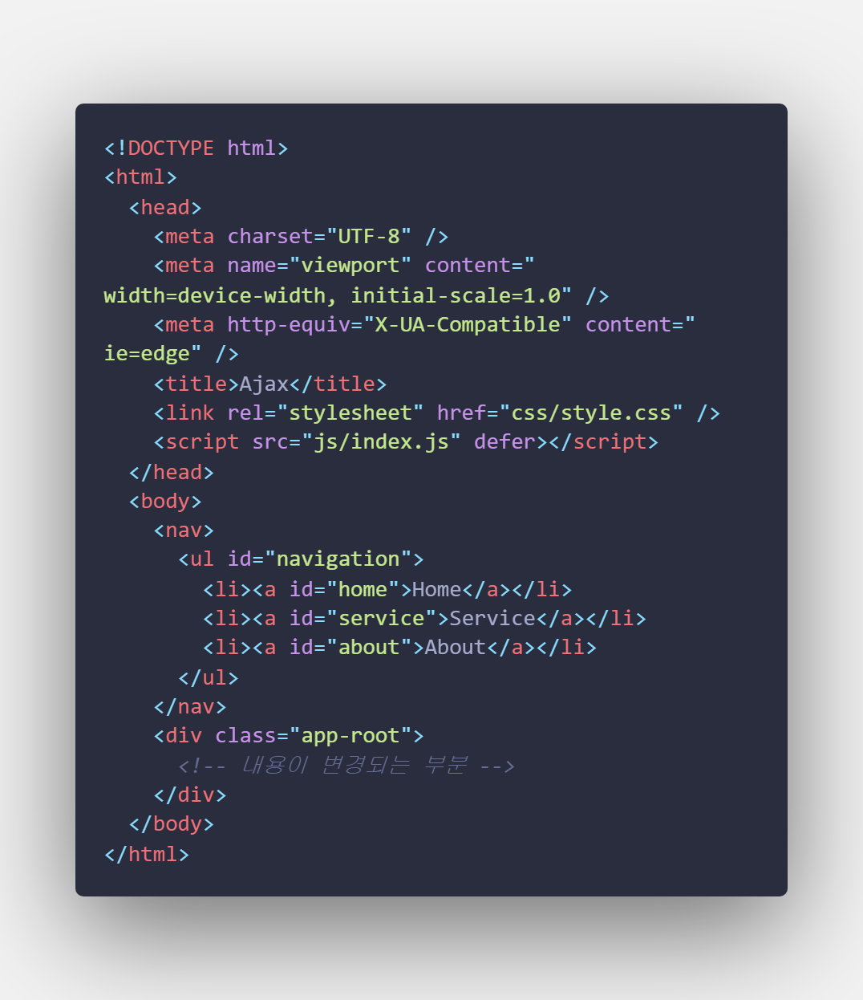

# :ledger: spa-tutorial

### :date: 공부 날짜 : 20. 04. 23 ~ 04. 24          
### :star: 공부 목적 : SPA의 사용 이유와 원리 이해            
### :bookmark: 참고 : https://poiemaweb.com/js-spa           

### SPA (Single Page Application)

    특징

    - 웹 어플리케이션에 필요한 모든 정적 리소스를 최초 한번 다운로드
    - 단일 페이지 구성
    - 새로운 페이지 요청시, 필요한 데이터만 받아 페이지 갱신
    - 전체적인 트래픽 감소 효과
    - 변경된 부분만 갱신

    단점

    - 초기 구동 속도
    - SEO (검색 엔진 최적화) 문제 - 페이지 새로고침이 없어서 발생

### Routing

    - 사용자가 요청한 URL 또는 event를 해석하고 새로운 페이지로 전환하기 위한 데이터를 취득하기 위해 서버에 필요한 데이터를 요청 하고 화면을 전환하는 행위

    브라우저가 화면을 전환 하는 경우 3가지

    1) 브라우저 주소창에 URL을 입력하여 이동
    2) 웹페이지 링크 클릭
    3) 브라우저의 방문 기록을 이용한 뒤로가기, 앞으로가기

### SPA까지의 Routing 방식의 변화

#### 1. link를 통한 방식

**HTML 구현**

- link tag 클릭시, tag의 attribute값인 경로가 URL의 path값에 추가 되어 주소창에 나타나고 리소스를 서버에 요청함

- 이때 서버는 완전한 리소스를 클라이언트에게 응답한다. **(서버 렌더링)**

- 이전 html 파일을 새로운 html 파일로 전환하는 과정에서 전체 렌더링이 발생하고 이때, **새로고침**이 된다.

**특징**

- JS없이 페이지마다 고유의 URL이 있어 history관리, SEO대응에 문제 없음
- 중복된 리소스를 다시요청하면서 새로고침이 발생하는 단점
- 복잡한 웹페이지의 경우, 중복된 리소스 요청으로 속도저하의 단점

#### 2. AJAX를 통한 방식

- AJAX : JS를 이용해 비동기적으로 서버와 브라우저가 데이터를 교환하는 통신방식
- 페이지의 일부만 갱신하고도 전체 렌더링 효과

**HTML 구현**

- link tag를 prevent하고 AJAX를 통해 서버에 리소스를 요청
- 응답시, 웹 페이지에 내용을 갈아끼워 html 완성

**특징**

- 불필요한 리소스 중복 요청 방지
- 페이지 전체를 렌더링 하는 것이 아닌 일부만 갱신하므로 향상된 사용자 경험을 구현

**JS 구현**

**특징**

- URL의 변경이 없음 (새로고침시 맨 처음 페이지로)
- history 관리 불가 (하나의 URL을 사용하기 때문에)
- SEO 이슈 (하나의 URL로 인해 새로고침이 없어 방문자수 낮음)

#### 3. Hash를 통한 방식

- Hash : URL의 fragment identifier의 고유기능인 앵커(Anchor)사용

**HTML 구현**

**특징**

- link tag의 href Attribute에 hash사용
- URL이 동일한 상태에서 hash가 변경되면 브라우저는 서버에 어떠한 요청도 하지 않음 **(hash만 변경되면 페이지 갱신 X)**
- 고유의 논리적 URL이 존재하므로 history 관리 가능

**JS 구현**

**특징**

- window의 hashchange 이벤트를 통해 hash 변경 감지
- URL에 불필요한 **#**이 들어가는 단점
- hash 방식의 사이트는 SEO 이슈 발생 **(가장 큰 단점)**

#### 4. PJAX를 통한 방식

- PJAX : HTML5의 History API의 pushState와 popState event를 이용한 방식

**HTML 구현**

- href Attribute로 path 값을 사용
- 클릭시 path 값이 URI로 추가

**JS 구현**

- pushState를 통해 주소창의 URL을 변경하고 URL을 history entry로 추가하지만 요청하지 않는다.

**특징**

- 서버에 새로운 요청을 하지 않으며, 페이지가 새로 갱신 되지 않음
- 페이지마다 고유의 URL이 존재해 history관리에 문제가 없음
- hash를 사용하지 않아 SEO 이슈가 발생하지 않음

### 요약 정리

결론적으로 각각의 특징을 알고 자신의 목적에 따라 어떤 방법이 가장 효과적인지 알고 사용하는 것이 좋다고 생각한다.

| 구분             | History 관리 | SEO 대응 | 사용자 경험 | 서버 랜더링 |
| :--------------- | :----------: | :------: | :---------: | :---------: |
| 전통적 링크 방식 |      ◯       |    ◯     |      ✗      |      ◯      |
| AJAX 방식        |      ✗       |    ✗     |      ◯      |      ✗      |
| Hash 방식        |      ◯       |    ✗     |      ◯      |      ✗      |
| PJAX 방식        |      ◯       |    ◯     |      ◯      |      △      |
